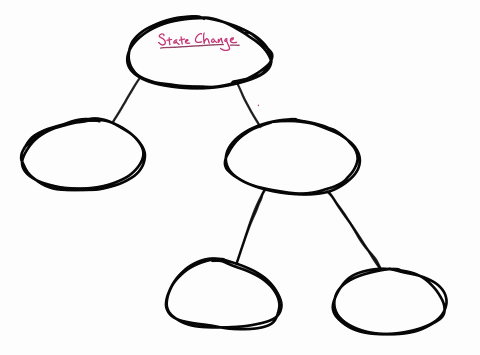

**Rendering**: React starts at the root of the component tree and works its way downard in hopes of finding all of the components that need updating. It does this by calling each component with its current props and looking at the output to determine if anything has changed.

**Reconcilliation**: Once React has worked its way through the entire component tree, it compares this new tree (e.g. the "[virtual DOM](https://twitter.com/dan_abramov/status/1066328666341294080?lang=en)") to the current state of the world and figures out what it needs to do the DOM in order to get everything up to date.

Rendering is _not_ the same as updating the DOM. You could render a component and have the results be exactly the same as it was last time, which means that we don't need to update the DOM.

## Phases

- The **Render phase** is where we render everything and calculate all of the changes that we need to do in order to get everything up to date.
- The **Commit phase** is where React goes ahead and makes those afformentioned changes to the DOM.
  - After React has updated the DOM, it updates all of the `ref`s to make sure they're pointing to the correct DOM nodes.
  - Next up, it synchronously runs all of the `componentDidMount` and `componentDidUpdate` methods on class-based components as well as of the `useLayoutEffect` hooks.
- Once this is all behind us, we move into the **Passive Effects phase** React then lets go on the main thread for a moment and pops a short timeout on the event loop before running all of the `useEffect` hooks.

React 18 introduced [concurrent rendering](https://www.telerik.com/blogs/concurrent-rendering-react-18), which brought with it features like [useTransition](useTransition.md).

The high-level is that this gives React the ability to pause work in the rendering phase to allow the browser to handle events. After it does this, React steps back in. Depending on what went down, it will either resume, throw away, or recaculate that work later. The commit phase then goes down as normal.

To my previous point about how rendering might not result in needing any updates to the DOM.

## On Rendering

In order to kick off the render phase, one of the following has to go down:

- The state is updated via either the `useState` or `useReducer` hooks or `this.setState()` or `this.forceUpdate()` in class-based components.
- Someone calls a `ReactDOM.Root`'s render method again.
- The [`useExternalSyncStore`](useSyncExternalStore.md) hook is called.

**Fun (read: important) fact**: By default, a parent component renders, React will work its way down the component tree re-rendering _all_ of the child components. It doesn't care if the props changed. The only requirement that React cares about is whether or not the parent component rendered, that enough to get a child component re-rendered. Now, that doesn't mean that the DOM is going to need to be updated in anyway, but this is how React comes that conclusion.

If we believe that [not doing stuff—or at least, doing _less_ stuff—is faster than doing stuff](Steve's%20Golden%20Rule%20of%20Performance.md), then one avenue for optimizing the performance of our React applications is to intervene and not render components that we believe don't need to be rerendered.

This is going to be one of our main themes today.

## On Committing

React calls the following during the **commit phase**: `componentDidMount`, `componentDidUpdate`, and `useLayoutEffect`. But, it's important to note that it calls these methods and hooks _before_ it has had a chance to paint.

The browser won't paint anything while JavaScript is executing and blocking the event loop. It'll wait for you to finish. This is why React runs all of these synchronously.

## Fibers

React keeps track of all of the current component instances. One of the core pieces of this data structure called a fiber, which have been around since React 16. When a component is rendered for the first time, React goes ahead and creates a fiber object to track the component instance. React stores all of the hooks for a component as a linked list attached to that component's fiber.

Fibers are in charge of answering the following questions:

- What type of component are we expecting at this point in the component tree? Was it a `div` last time and now its a `span`? Well, then we probably need to reconcile that.
- What are the current props and state associated with this component instance?
- Who are its parents, siblings, and children?

To the first bullet point, if React sees that a component type has changed, it will try to optimize for the likely scenario that this is a fundamentally different tree from this point forward and it will just toss the entire sub-tree out and start over. This is where doing crazy stuff like dynamically defining components inside of another one can get you into trouble. This will be a different component in memory and it will cause React to take drastic measures.

## Keys

In addition to keeping track of component types, React sometimes relies on the `key` prop to differentiate particular components from their siblings of the same time. You've probably gotten yelled at about not using keys when mapping over a collection to create components.

When adding, removing, or changing the order of the collection, having unique keys allows React to keep track of which is which and—ideally—avoid having to spend too much effort trying to figure out what changed.

> [!TODO] Keys and forms
>
> - [ ] Create a single form that has a `key` associated from the selected item.

