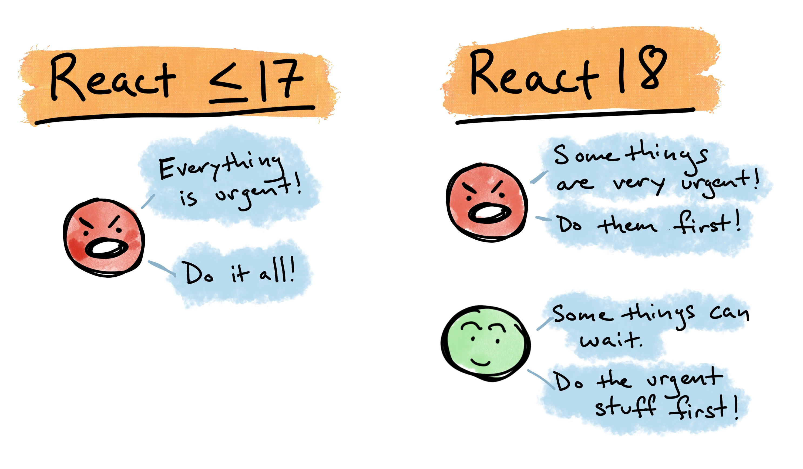

Transitions are a new API in React 18 that aspire to help keep your application responsive even during large screen updates and allows you to mark specific updates as "transitions."

(See also: the [`startTransition` API](startTransition%20API.md))

Let's take the example of a filterable list. As the user types, we want the list to automatically update based on the content of the input field that they're typing in. With a long enough or complex enough list, then _could_ get slow and cause the UI to be unresponsive. In this example, this is particularly annoying because the user typing and you know what users (e.g. I) hate? When there is a lag between when I hit the key and when something shows up on the page. Gross.

In this example, there are really two things going down.

1. We're updating the state of the input field.
2. We're using that state to determine what we should be showing in the list.

Like I said, responding to my keystroke is way more urgent than updating the list. One of those being slow is going to hurt my feelings way more than the other one and there is no reason why the latter should slow down the former if we can avoid it, right?

If everything is urgent then nothing is urgent and prior to React 18, everything was considered urgent.

Transitions give us the ability to tell React what's urgent and what can wait.

Additionally, the cool thing here is that if other urgent actions come in, a non-urgent update will be interrupted. If we think about this in terms of our filterable list example, it means that as the user continues to type, those urgent updates will interrupt a previous rendering of the list since it's no longer needed anyway.

The `useTransition` hook also gives us a boolean value that we can use to display a spinner if there is a transition pending. Previously, you'd have to do something like this by hand. Take my word for it, it wasn't particularly fun.

