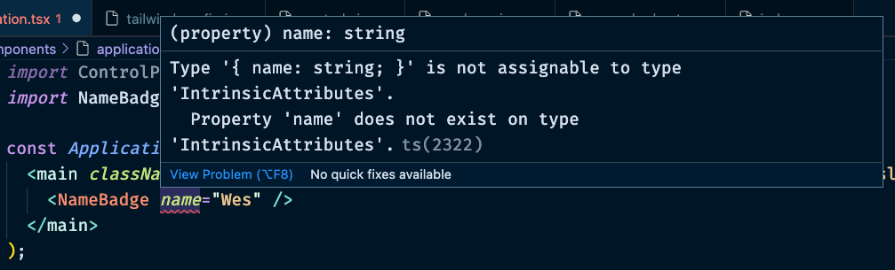

It turns out that in React, sometimes we pass props to our components instead of just using them as a fancy way to break up static HTML. Having my name hardcoded into the markup is cool, I guess, but it would be _even better_ if we could pass a prop in there.

Maybe, we do something like this:

```tsx
import NameBadge from './name-badge';

const Application = () => (
  <main className="application">
    <NameBadge name={'Brendan Kelly'} />
  </main>
);

export default Application;
```

Now, if you tried that, you'll see that TypeScript is already very annoyed with you.



Okay, that's somewhat cryptic. But, we get the gist. If this was JavaScript, we could pass whatever garbage we wanted to a component. But TypeScript is telling us, "Hey look, you told us that this function doesn't take any arguments and now we're passing it props? What gives?

Let's do the obvious thing and update our component to take some props.

```tsx
const NameBadge = ({ name }: { name: string }) => {
  return (
    <section className="badge">
      <header className="badge-header">
        <h1 className="text-5xl">HELLO</h1>
        <p>My name is…</p>
      </header>
      <div className="badge-body">
        <p className="badge-name">{name}</p>
      </div>
      <footer className="badge-footer" />
    </section>
  );
};

export default NameBadge;
```

Now, we have a new issue:


TypeScript was able to look at the return value of the function and figure it out. But, it's not smart enough to acquiesce what the values being passed in are. We need to give is a little extra information.

In the past, we might have done this with [`PropTypes`](https://npm.im/prop-types).

```tsx
NameBadge.propTypes = {
  name: PropTypes.string,
};
```

In JavaScript, we've traditionally used `PropTypes` in order to make sure that we were passing the correct types to our React components. `PropTypes` would only run at run-time and in development and would spit out console warnings in the event that the component recieved the wrong types. This was good, but we can do better with TypeScript—specifically, we can do this statically and at compile time.

This means, that our application won't build if we it looks like we're going to have a problem.

Basically, you might have already been doing a lot of the work with a lot less of the gain. Don't tell me I passed you the wrong types at in my browser console. Tell me in my editor while I am editing.

## Specifing what types you props out to be

The good news here is that now only is TypeScript _way_ more thorough. It's actually a lot easy to add types to the props in your components.

If these were a simpler TypeScript function, we'd add a colon after the argument to specify what type it should be.

```ts
const addTwo = (n: number) => n + 2;
```

Props are an object in TypeScript, so we need to specify what each type each key in the object should be.

```ts
const NameBadge = ({ name }: { name: string }) => {
  // …
};
```

If that looks a little confusing to you compared to how simple and elegant `addTwo` was then you can go also think of it like this:

```tsx
const NameBadge = (props: { name: string }) => {
  return <p>{props}</p>;
};
```

And now it's happy with us.

## Specifying types

As you can imagine, this could get a little out of control if we had lots of props. So, we can also create a new prop and tell TypeScript that our component is expecting to a lot of props. Let's see what that would look like.

This the idiomatic pattern that you can expect to see regularly:

```ts
type NameBadgeProps = {
  name: string;
};

const NameBadge = ({ name }: NameBadgeProps) => {
  // …
};

export default NameBadge;
```

It's convention to just take the name of your components and tack on -`Props` on to the end. You don't have to be overly creative.

This isn't particularly compelling code, but if you want, you can check it out on the `basic-implementation` branch.

And with that, it's time to move on to [Refactoring from PropTypes, an exercise](Refactoring%20from%20PropTypes,%20an%20exercise.md).
